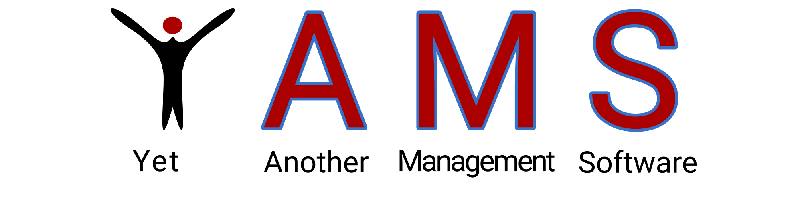

---

**Y**et **A**nother **M**anagement **S**oftware is a management system for patients, customers and their pets.
It uses a centralized data storage system to allow seamless utilization of different client platforms. Desktop
applications are shipped with an embedded version of the data storage system and can therefore run completely locally.

## Introduction

The software allows management of clients, their relationships, their pets, the treatment
of both the pets and the clients, the selling of products, the provision of seminars and events, and the billing
of all those actions.

The underlying persistence model is expected to be implemented with SurrealDB, but other than that is abstracted
enough to allow flexible usage of the same codebase. This project can run as desktop application, where the data files
are stored locally on the executing machine, or as web application connected to a remote database, all using the exact
same source code. The desktop application can be configured to also connect to a remote database. More on that in
the [frontend's README](frontend/README.md).

### Possible extensions

This project may be extended in the future by adding the following features:

- [ ] Authentication in frontend and backend (required for web application deployment)
- [ ] SurrealDB websocket support in web application (required for web application deployment)
- [ ] Deployment as web application
- [ ] Move SurrealDB file storage to file system (also in remote backend)
- [ ] Integrate appointment management into homepage as interactive calendar

## Installation

The latest versions can be seen and downloaded on the
[releases page](https://github.com/HTBLA-Grieskirchen/YAMS/releases).

Once an installer (`.deb` or `.msi`) is downloaded, the installation process can be started like any other software:
Installation through package manager (Linux) or installation by opening/double-clicking the file (Windows).  
The `.AppImage` can directly be executed on Linux systems.

## Usage

Once installed, the local app can be configured using a `yamsconfig.json` file which is searched for in the
system's default config path. The web app can be configured upon deployment in the
[source file](frontend/src/config/config.json).

If required, the SurrealDB can be started as described in [this README](backend/README.md).

## License

This project is licensed under a custom, non-standard derivative of the
[Boost Software License](https://www.boost.org/users/license.html).   
It can be found [here](LICENSE).

## Background

Our team consists of:

- [Daniel Ferihumer](https://github.com/FerihumerD180104)
- [Julian Bachinger](https://github.com/jbachinger18)
- [David Edthaler](https://github.com/EdtDavid)
- [David Rathmair](https://github.com/drathmair)
- [Dominik Wernsdorfer](https://github.com/domiiii1320)
- [Tim Peko](https://github.com/TimerErTim)

and we are in the senior year of the [HTBLA Grieskirchen](https://htl-grieskirchen.net) medicalinformatics branch.

This project is part of our classes and developed for a private client working in the medical field.

### Technologies

We decided to use the following technologies:

- [Backend](backend)
  - Database - [SurrealDB](https://surrealdb.com)
- [Frontend](frontend)
  - [Web UI](frontend/src)
    - Language - [TypeScript](https://www.typescriptlang.org/)
    - Framework - [Next.js](https://nextjs.org/)
    - State Management - [MobX](https://mobx.js.org/)
    - Design - [TailwindCSS](https://mobx.js.org/)
  - [Desktop App](frontend/src-tauri)
    - Language - [Rust](https://rust-lang.org)
    - Framework - [Tauri](https://tauri.app)
    - Storage - [embedded SurrealDB](https://crates.io/crates/surrealdb)

