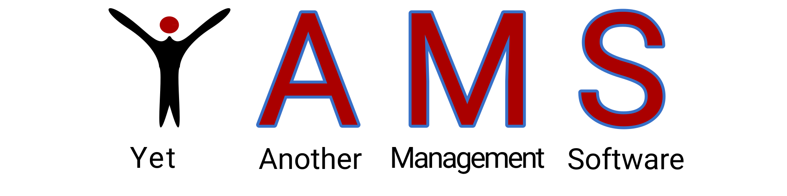

## 

**Y**et **A**nother **M**anagement **S**oftware is a management system for patients, customers and their pets.
It uses a centralized data storage system to allow seamless utilization of different client platforms. Desktop
applications are shipped with an embedded version of the data storage system and can therefore run completely locally.

## Introduction

The software allows management of clients, their relationships, their pets, the treatment
of both the pets and the clients, the selling of products, the provision of seminars and events, and the billing
of all those actions.

The underlying persistence model is implemented with [libsql](https://libsql.org) (SQLite) with a hexagonal architecture in Rust.

## Installation

The latest versions can be seen and downloaded on the
[releases page](https://github.com/HTBLA-Grieskirchen/YAMS/releases).

## Usage

Once installed, the local app can be configured using a `yamsconfig.json` file which is searched for in the
system's default config path.

## Technologies

We decided to use the following technologies:

- **Backend**
  - Language: Rust
  - Database: [libsql](https://libsql.org) (SQLite)
  - API: [poem-openapi](https://github.com/poem-web/poem)
- **Frontend**
  - Language: [TypeScript](https://www.typescriptlang.org/)
  - Framework: [Next.js](https://nextjs.org/)
  - State Management: [TanStack Query](https://tanstack.com/query) (Migrating from MobX)
  - Design: [TailwindCSS](https://tailwindcss.com/), [HeroUI](https://heroui.com/)
- **Desktop App**
  - Framework: [Tauri](https://tauri.app)
